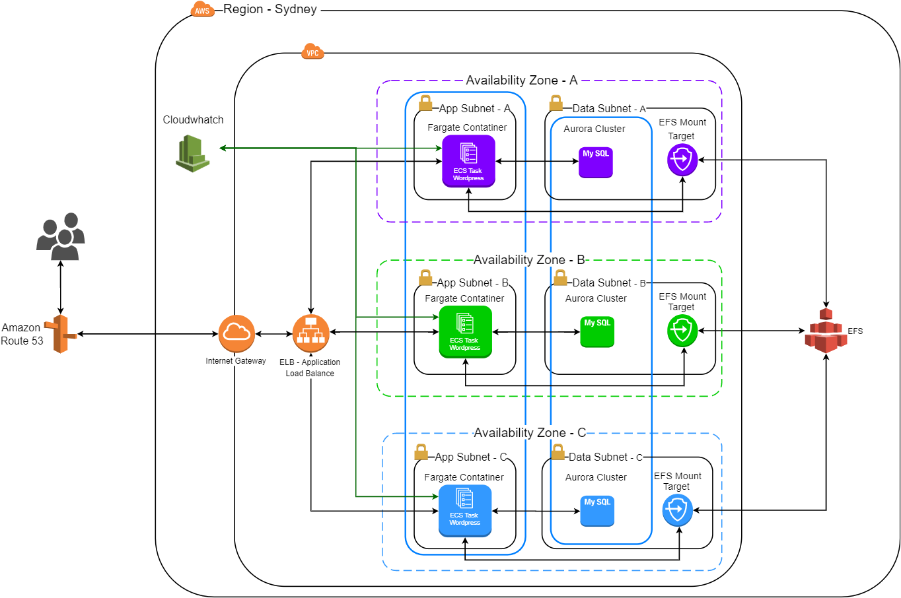

# DevOps - Project 01 - Group 01 - Wordpress Solution 

Solution based on AWS to install wordpress site with Fargate and Aurora DB Cluster. 

## Solution Diagram 



## Requirements 

- Make
- Docker-compose 
- Git
- Bash
- AWS CLI

## Usage

Clone or download the repository:

```
git clone https://github.com/devopsacademyau/2020-feb-project1-group1.git
```

Set up your AWS credentials:

```
aws configure
```


## Prepare (optional)

Run `make prepare` and edit your `.env` file to your preferences.


## Plan:

Create an execution plan:
```
make plan
```


## Build:

Create an ECR repository, build wordpress docker image and push to the repository created:
```
make build
```


## Deploy:

Deploy the infrastructure on AWS using the docker image pushed to ECR
```
make deploy
```


## Destroy:

**WARNING:** This will delete your configuration, database, EFS and all other resources.

Destory all the infrastructure created on AWS
```
make destroy
```


## Clean:

Delete files and docker images created on plan, build and deploy targets.
```
make clean
```
